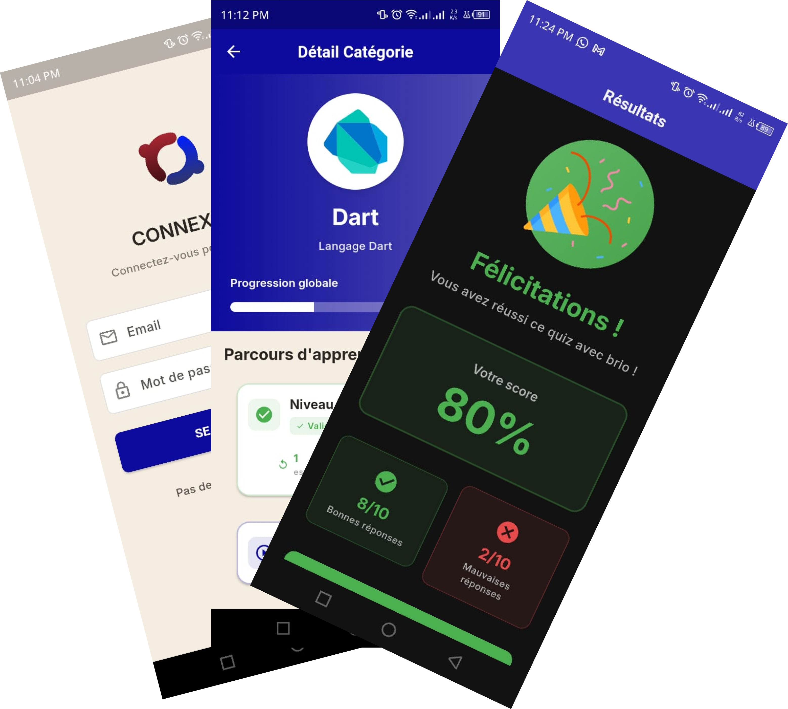

# Code Ascend

<p align="center">
  
</p>

<p align="center">
  <strong>Application mobile de quiz techniques pour développeurs</strong>
</p>

<p align="center">
  <a href="#-vue-densemble">Vue d'ensemble</a> •
  <a href="#-fonctionnalités">Fonctionnalités</a> •
  <a href="#-stack-technique">Stack Technique</a> •
  <a href="#-architecture">Architecture</a> •
</p>

---

## Vue d'ensemble

**Code Ascend** est une application mobile Flutter permettant aux développeurs de tester et améliorer leurs connaissances techniques à travers des quiz progressifs sur diverses technologies (Flutter, JavaScript, Python, React, etc.).

### Concept clé
- **Système de progression par niveaux** : Débutant → Intermédiaire → Avancé
- **Déblocage conditionnel** : Obtenir ≥80% pour accéder au niveau suivant
- **Mode hors-ligne intelligent** : Les tentatives sont mises en file d'attente et synchronisées automatiquement à la reconnexion

---

## Fonctionnalités

### Authentification
- Inscription / Connexion sécurisée (JWT)
- Gestion de session persistante
- Auto-logout en cas de token expiré

### Quiz Interactifs
- Questions à choix unique ou multiple
- Sauvegarde automatique de la progression
- Reprise d'un quiz interrompu
- **Soumission offline** avec synchronisation automatique
- Révision des réponses avec correction détaillée

### Statistiques & Progression
- Score moyen et taux de réussite global
- Série de victoires (streak) 🔥
- Historique complet des tentatives
- Progression par catégorie avec badges de niveau
- Tentatives récentes avec détails

### Interface Moderne
- **Thème clair / sombre** avec persistance
- Design Material 3
- Animations fluides et élégantes
- Navigation intuitive avec bottom navigation bar
- Responsive et adaptatif

---

## Stack Technique

### Frontend Client
- **Flutter** 3.x avec Dart
- **BLoC** (Business Logic Component) pour la gestion d'état
- **GoRouter** pour la navigation déclarative
- **Dio** pour les appels API avec intercepteurs
- **GetIt** pour l'injection de dépendances
- **Dartz** pour la programmation fonctionnelle (Either)
- **Equatable** pour les comparaisons d'objets
- **SharedPreferences** pour le stockage local
- **Connectivity Plus** pour la détection de connexion

### Backoffice (Admin interface)
- **Next.js**
- Lien: `https://quiz-app-dashboard-puce.vercel.app`
- Authentification JWT session 

### Backend (API)
- **FastAPI** (Python)
- Documentation: `https://backend-quiz-0ab2.onrender.com/docs`
- Authentification JWT session based
- API RESTful

---

## Architecture

Le projet suit l'architecture **Clean Architecture** avec séparation stricte en couches :

```
lib/app/
├── core/                           # Couche transversale
│   ├── di/                         # Dependency Injection (GetIt)
│   ├── error/                      # Gestion des erreurs (Failures)
│   ├── routing/                    # Navigation (GoRouter)
│   ├── themes/                     # Thèmes et couleurs
│   ├── utils/                      # Utilitaires et constantes
│   └── widgets/                    # Widgets réutilisables
│
├── features/                       # Fonctionnalités (par feature)
│   ├── auth/                       # Authentification
│   │   ├── data/                   # Sources de données & Repositories
│   │   │   ├── datasources/        # Remote & Local DataSources
│   │   │   ├── models/             # Models (JSON ↔ Entity)
│   │   │   └── repositories/       # Implémentation Repository
│   │   ├── domain/                 # Logique métier pure
│   │   │   ├── entities/           # Entités métier
│   │   │   ├── repositories/       # Contrats Repository
│   │   │   └── usecases/           # Cas d'usage
│   │   └── presentation/           # UI & BLoC
│   │       ├── bloc/               # BLoC (Events, States)
│   │       ├── pages/              # Écrans
│   │       └── widgets/            # Widgets spécifiques
│   │
│   ├── category/                   # Catégories de quiz
│   ├── quiz/                       # Quiz & Questions
│   ├── attempts/                   # Historique des tentatives
│   └── user_stats/                 # Statistiques utilisateur
│
└── main.dart                       # Point d'entrée
```

### Principes clés
- **Séparation des responsabilités** : Data / Domain / Presentation
- **Inversion de dépendances** : Les couches externes dépendent des couches internes
- **Single Responsibility** : Chaque classe a une seule raison de changer
- **Testabilité** : Architecture facilitant les tests unitaires

---
## Captures d'écran

### Authentification
- Splash animé
- Écrans Login / Register élégants

### Quiz
- Interface de quiz intuitive avec progression
- Questions à choix unique/multiple
- Timer et navigation fluide

### Statistiques
- Dashboard complet avec graphiques
- Historique des tentatives avec filtres
- Progression par catégorie

---

## Fonctionnalités Techniques Avancées

### Mode Hors-ligne
- **File d'attente locale** : Les tentatives de quiz sont sauvegardées localement si pas de connexion
- **Synchronisation automatique** : À la reconnexion, toutes les tentatives en attente sont envoyées
- **Cache intelligent** : Les données sont mises en cache pour un affichage rapide

### Gestion d'état avec BLoC
- **Séparation Events/States** : Architecture événementielle claire
- **Stream-based** : Reactive programming pour une UI fluide
- **Singleton vs Factory** : Gestion optimale du cycle de vie des BLoCs

### Navigation Intelligente
- **GoRouter** : Navigation déclarative avec routes typées
- **Deep linking** : Support des liens profonds
- **Guard de route** : Redirection automatique selon l'état d'authentification
- **State preservation** : Conservation de l'état avec `StatefulShellRoute`

### Sécurité
- **Token JWT** : Stockage sécurisé avec auto-refresh
- **Intercepteurs Dio** : Ajout automatique du token aux requêtes
- **Auto-logout** : Déconnexion automatique sur token expiré (401)

---

## Remerciements

- [Flutter](https://flutter.dev) pour le framework
- [FastAPI](https://fastapi.tiangolo.com) pour le backend
- [Next.js](https://nextjs.org) pour le backoffice
- La communauté open-source pour les packages utilisés